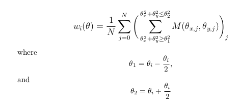

# CrossCorrelation
Typically if one wants to compute the angular auto- or cross-correlation of discrete point sources one would 
use the Landy-Szalay estimator (http://adsabs.harvard.edu/abs/1993ApJ...412...64L) with one (auto) or two (cross)
positional catalogs. Similarly, if the signal is diffuse, one can use FFTs and compute power spectra. This code
is a kind of amalgamation of the two. We wanted to measure the correlation of foreground galaxies (point sources) with 
diffuse background light, specifically that of the cosmic far-infrared background (CFIRB). 

Given a catalog of foreground sources and a sky map M containing background light, this module goes to each catalog position 
on the map and sums all the pixel values within some annulus coresponding to angular scale. For catalog entry j = 0,1...N, the cross-correlation at annular bin i is

